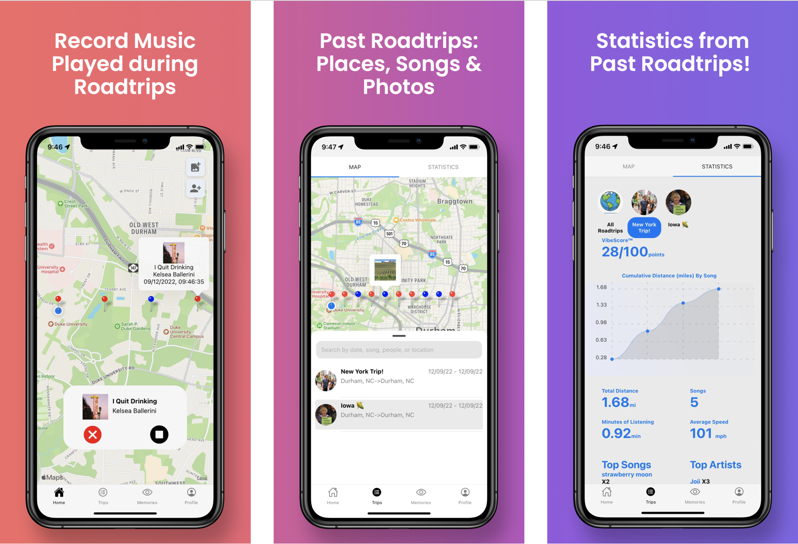

## MusicMap 🎧
MusicMap is a a mobile app that documents the songs played during road trips, allowing users to not only revisit a catalog of all the songs played during the trip, but also the specific locations associated with each song. 

Features: 

* Start roadtrip session, add friends and pictures to the roadtrip; app will record the songs played and where they were played
* View past roadtrips (where you went, what songs you played, photos you added) and statistics about each roadtrip (top songs, top artists, song during which you're driving the fastest, minutes of listening, etc.)
* Access video collages of photos from past roadtrips (with the top song from that roadtrip as the sound track)
* Manage friends! 
